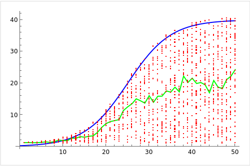

## Directory structure

This folder contains a number of test cases for the fantom Lachesis consensus protocol code. Graphs without forks/cheaters are placed into the `/graphs` folder, whereby each graph is represented pictorially with a PDF and in text format for programs as a .txt file. The adjacency matrix of each DAG's validators are also placed as .txt files into the folder. In the top left section of the PDF, some properties with which the graph was generated are noted. Similar to `/graphs`, the `/cheaters` folder contains a number of graphs as PDFs and as .txt files with the difference being that each validator has a non-zero probability of being a cheater, that is, a validator that can create forks in the graph. <br>

The `/results` and `/cheaters_results` folders contain the results of the corresponding DAGs in `/graphs` and `/cheaters` as PDFs. <br>

This folder also contains a `graph.py` and an `automate_graphing.py` script to automate generating custom test cases.


## Generating inputs

Run `python3 graph.py`

### Script inputs:


If you press enter, the defaults take hold, otherwise the inputs are "y"/"n", an int value for how many graphs, 
levels, nodes(validators) you would prefer, and a float value of 0-1.0 for the probability of a random validator 
being a cheater, a node/validator being present at a given time step, and a node/validator having an edge to a
parent in the prior time step.

-  Annotate graphs (y/n): (Default is no) 
-  How many graphs would you like to generate: (Default is 50) 
-  Enter the probability that a random validator is a cheater: (Default is 0.2) 
-  Enter the number of levels/time steps in each graph or type 'r' or 'random' for a random value each iteration: (Default is 10) 
-  Enter the number of validator event nodes in each level or type 'r' or 'random' for a random value each iteration: (Default is 5) 
-  Enter the probability that an event node is present or type 'r' or 'random' for a random value each iteration: (Default is 0.65) 
-  Enter the probability that an event node observes another validator's event node or type 'r' or 'random' for a random value each iteration: (Default is 0.3) 
-  Enter the probability that any two given validators are neighbors or type 'r' or 'random' for a random value each iteration: (Default is 0.5) 
-  Enter the base directory for output files: (Default is current directory) 
-  Enter the starting index for file numbering: (Default is 1) 

## Script outputs:

-  `graph_{i}.pdf` file is created in `<base-directory>` as a pictorial representation of the DAG
-  `graph_{i}.txt` file is created in `<base-directory>` as the textual representation of the DAG for programs
-  `neighbors_{i}.txt` file is created in `<base-directory>` as the textual representation of the adjacency matrix/neighbors dictionary of the corresponding DAG's validators

## Automating graph generation:

If you run `automate_graphing.py` with a set of custom parameters for the above `graph.py` file in the `parameters_list` array of the `automate_graphing.py` file, all the DAGs with your configurations and folders will be created. For example, you could specify:

### Parameters List
- ("y", "20", "0", "20", "4", "0.65", "0.4", "0.5", "./graphs", "1")
- ("y", "20", "0", "20", "5", "0.65", "0.4", "0.5", "./graphs", "21")
- ("y", "960", "0", "r", "r", "r", "r", "r", "./graphs", "41")
- ("y", "20", "0.3", "20", "4", "0.65", "0.4", "0.5", "./cheaters", "1")
- ("y", "20", "0.3", "20", "5", "0.65", "0.4", "0.5", "./cheaters", "21")
- ("y", "960", "0.3", "r", "r", "r", "r", "r", "./cheaters", "41")
`

You can see how each of those array entries correspond to inputs for `graph.py` above. Place each tuple inside the `parameters_list` array in `automate_graphing.py` and run `automate_graphing.py`:

```python
parameters_list = [
    ("y", "20", "0", "20", "4", "0.65", "0.4", "0.5", "./graphs", "1"),
    ("y", "20", "0", "20", "5", "0.65", "0.4", "0.5", "./graphs", "21"),
    ("y", "960", "0", "r", "r", "r", "r", "r", "./graphs", "41"),
    ("y", "20", "0.3", "20", "4", "0.65", "0.4", "0.5", "./cheaters", "1"),
    ("y", "20", "0.3", "20", "5", "0.65", "0.4", "0.5", "./cheaters", "21"),
    ("y", "960", "0.3", "r", "r", "r", "r", "r", "./cheaters", "41"),
]
```

## How graphs are generated

The user inputs provided to the `graph.py` script dictate how the test case will look. However there are also a few additional properties (covered later):

-  The value of the probability that a random validator is a cheater dictates the probability that nodes in that row of the DAG are going to be another validator's forking events.
-  The number of levels dictates how many "columns" the DAG will have - that is, what is the maximum number of events a given validator can emit in one row of the DAG?
-  The number of validator event nodes dictates how many validators are present at most - that is, how many validators/rows are there in the DAG?
-  The probability that an event node is present dictates the probability that a node emits an event at a given column/time.
-  The probability than an event node observes another validator's event node dictates the probability that a validator observes its neighbor's event at a given time.  
-  The probability that any two given validators are neighbros dictates the probability that two given validators in a DAG are neighbors/can observe each others events. The program ensures every validator has at least one neighbor.
-  The base directory dictates where to output test case files
-  The starting index for file numbering is for convenience when automating scripts to dictate at which number should test case outputs start in the given folder

With regards to additional properties:

-  In the script, events in a given row have a 10% probability of starting at a random time (at a random column). That is to say, they start later than the rest of the validators.
-  Events in a given row also have a 5% probability of stopping at a random time (at a random column). That is to say, validators for that row stop emitting events before the rest of the validators.

This is defined and can be configured in these lines:

```python
    start_times = [
        random.randint(0, num_levels) if random.random() < 0.1 else 0
        for _ in range(num_nodes)
    ]
    stop_times = [
        random.randint(0, num_levels) if random.random() < 0.1 else num_levels - 1
        for _ in range(num_nodes)
    ]
```
<br>
<p align="center">
  
</p>
<br>

In order not to skew the weights in the graph in favor of one validator or of a small group of validators, a logistic function (see above) is used to assign a variable weight to the validators. 

- The horizontal axis represents the number of validators
- The vertical axis represents the weight
- The blue line represents the logistic function
- The green line represents the average weight of the validators
- The red dots represent the random weight each of the x validators were assigned if there were x validators in the graph in this example

 Each validator's weight is a random integer in [1, ⌊f(x)⌋+1] where x is the number of validators in the DAG, and f(x) is a logistic function. The advantage of using this approach is that if there is a small number of validators, each validator's weight is closer to 1 to prevent skewing in favor of other validators, so as to prevent a scenario where 9 validators have a weight of 1 while 1 validator has a weight of 10, for example. The other advantage of using a logistic function f(x) is that if there is a high number of validators, the maximum weight a validator can have can be set as a parameter of the logistic function so that as the number of validators grows the maximum weight any given validator can have does not. 