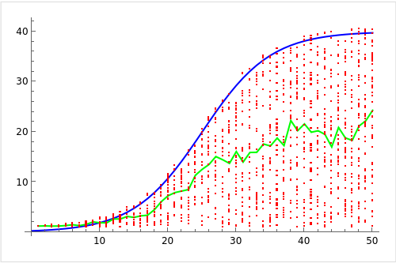

## Directory Structure

This folder contains various test cases, depicted as Directed Acyclic Graphs (DAGs), for the Fantom Lachesis consensus protocol. Each DAG comprises nodes known as Events, with each row corresponding to Events emitted by a single validator.

The directory is organized into several subfolders:

-  `/graphs`: This subfolder contains DAGs representing scenarios without forks or cheaters. Each graph is visually represented as a PDF and also detailed in a `.txt` file for programmatic access. The adjacency matrix for each DAG's validators is also provided as a `.txt` file. The PDFs include annotations in the top left section detailing the properties used to generate the graph.
-  `/cheaters`: Similar to the `/graphs` subfolder, this contains DAGs represented as PDFs and `.txt` files. However, in these scenarios, each validator has a non-zero probability of being a cheater (a validator that can create forks in the graph).
-  `/results` and `/cheaters_results`: These subfolders store the results of the first 100 DAGs in the `/graphs` and `/cheaters` folders respectively, represented as PDFs.

Apart from these subfolders, this directory also includes two scripts: `graph.py` and `automate_graphing.py`, which help automate the generation of custom test cases.
## Generating tests

To generate test cases, run the script using the command `python3 graph.py`. The script offers several options for customization. If you hit 'Enter' without providing an input, the script will use the default values. However, you can also input "y"/"n" for binary choices, integers for number values, and a float between 0 and 1.0 for probabilities.

- Annotate graphs (y/n): (Default: No)
- Number of graphs to generate (Default: 50)
- Probability that a random validator is a cheater (Default: 0.2)
- Number of levels/time steps in each graph (Default: 10). You can also input 'r' or 'random' for a random value each iteration.
- Number of validator Event nodes in each level (Default: 5). You can also input 'r' or 'random' for a random value each iteration.
- Probability that an Event node is present (Default: 0.65). You can also input 'r' or 'random' for a random value each iteration.
- Probability that an Event node observes another validator's Event node (Default: 0.3). You can also input 'r' or 'random' for a random value each iteration.
- Probability that any two given validators are neighbors (Default: 0.5). You can also input 'r' or 'random' for a random value each iteration.
- Base directory for output files (Default: Current directory)
Starting index for file numbering (Default: 1)

## Script outputs:

Upon execution, the script creates:

- `graph_{i}.pdf`: A pictorial representation of the DAG saved in the specified base directory.
- `graph_{i}.txt`: A textual representation of the DAG for programmatic access, saved in the specified base directory.
- `neighbors_{i}.txt`: A textual representation of the adjacency matrix/neighbors dictionary of the corresponding DAG's validators, saved in the specified base directory.

## Automating graph generation:

The `automate_graphing.py` script allows for automated graph generation by setting custom parameters for the `graph.py` script in the `parameters_list` array of the `automate_graphing.py` file. Each tuple in the array corresponds to the parameters listed above. After adjusting the `parameters_list`, simply run `automate_graphing.py` to generate all DAGs with your configurations.

Here's an example of a configured parameters_list array:

```python
parameters_list = [
    ("y", "20", "0", "20", "4", "0.65", "0.4", "0.5", "./graphs", "1"),
    ("y", "20", "0", "20", "5", "0.65", "0.4", "0.5", "./graphs", "21"),
    ("y", "960", "0", "r", "r", "r", "r", "r", "./graphs", "41"),
    ("y", "20", "0.3", "20", "4", "0.65", "0.4", "0.5", "./cheaters", "1"),
    ("y", "20", "0.3", "20", "5", "0.65", "0.4", "0.5", "./cheaters", "21"),
    ("y", "960", "0.3", "r", "r", "r", "r", "r", "./cheaters", "41"),
]
```

Each entry in the array aligns with the respective input for `graph.py`. Simply populate the parameters_list array in `automate_graphing.py` with your desired configurations and run `automate_graphing.py`.

## Graph Generation Process

The structure and properties of the test cases created by the `graph.py` script are controlled by the user inputs. In addition to the the user inputs discussed next, there are some additional properties discussed later:

- The probability that a random validator is a cheater influences the chance that nodes in a specific row of the DAG will be another validator's forking Events.
- The number of levels determines the number of "columns" the DAG will have, i.e., what is the maximum number of Events a given validator can emit in one row of the DAG?
- The number of validator Event nodes specifies the maximum number of validators present, i.e., how many validators or rows are in the DAG?
- The probability that an Event node is present controls the chance that a validator emits an Event at a particular time or column.
- The probability that an Event node observes another validator's Event node determines the chance that a validator observes its neighbor's Event at a specific time.
- The probability that any two given validators are neighbors specifies the likelihood that any two validators in a DAG are neighbors and can observe each other's Events. The script ensures that every validator has at least one neighbor.
- The base directory defines where to save the test case files.
The starting index for file numbering is for convenience when automating scripts, dictating the starting number for test case outputs in the provided folder.

Regarding additional properties:

- In the script, Events in a given row have a 10% probability of starting at a random time (at a random column). This means they commence later than the other validators.
- Events in a specific row also have a 5% probability of stopping at a random time (at a random column). This signifies that validators for that row cease emitting Events before the rest of the validators.

This is defined and can be configured in these lines:

```python
start_times = [
    random.randint(0, num_levels) if random.random() < 0.1 else 0
    for _ in range(num_nodes)
]
stop_times = [
    random.randint(0, num_levels) if random.random() < 0.1 else num_levels - 1
    for _ in range(num_nodes)
]
```

<br>
<p align="center">
  
</p>
<br>

To avoid skewing the graph weights in favor of one validator or a small group of validators, a logistic function (see above) is used to assign variable weights to the validators.

- The horizontal axis signifies the number of validators.
- The vertical axis represents the weight.
- The blue line denotes the logistic function.
- The green line shows the average weight of the validators.
- The red dots correspond to the random weight each of the `x` validators would be assigned if there were `x` validators in the graph in this example.

Each validator's weight is a random integer in `[1, ⌊f(x)⌋+1]`, where `x` is the number of validators in the DAG, and `f(x)` is a logistic function. Using this approach ensures that if there is a small number of validators, each validator's weight is closer to 1, thereby preventing skewing in favor of some validators. For instance, this prevents a situation where nine validators have a weight of 1 while one validator has a weight of 10. Another advantage of using a logistic function `f(x)` is that if there is a high number of validators, the maximum weight a validator can have can be set as a parameter of the logistic function so that as the number of validators grows, the maximum weight any given validator can have does not.

The parameters `L, k, x0, x` of the logistic function can be adjusted in the `random_weight(x)` function of `graph.py`:

```python
def logistic(L, k, x0, x):
    return L / (1 + math.exp(-k * (x - x0)))

def random_weight(x):
    return int(logistic(40, 0.2, 25, x) * random.random()) + 1
```